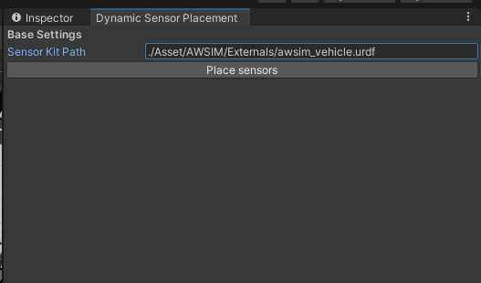
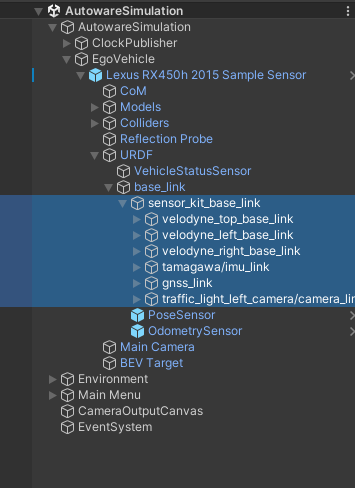

# Dynamic Sensor Placement

This tool allows you to dynamically place sensors on a car using positions and rotations specified in a URDF file.

## Follow the steps to generate the urdf file:
1. Build Autoware by following the instruction in https://autowarefoundation.github.io/autoware-documentation/main/installation/autoware/source-installation/.

2. Modify L3-4 in
    `$HOME/autoware/src/universe/autoware.universe/launch/tier4_vehicle_launch/urdf/vehicle.xacro`
    as the following,

            <xacro:arg name="vehicle_model" default="sample_vehicle"/>
            <xacro:arg name="sensor_model" default="awsim_sensor_kit"/>

3. Run the following commands:

        source $HOME/autoware/install/setup.bash

        ros2 run xacro xacro -o awsim_vehicle.urdf $HOME/autoware/src/universe/autoware.universe/launch/tier4_vehicle_launch/urdf/vehicle.xacro

4. You should now have a URDF file named `awsim_vehicle.urdf`.

## Using the Dynamic Sensor Placement tool:
1. Open up AWSIM and place the generated `awsim_vehicle.urdf` in the Externals folder so the path will be `./Assets/AWSIM/Externals/awsim_vehicle.urdf`.

    

2. Now, under open up the `Dynamic sensor placement` tool under AWSIM menu.
    

3. Enter the path to the URDF file,
    

4. Click "Place sensors". All the sensors should be automatically placed on the car.

## Note

1. Only the game object named sensor_kit_base_link and its direct children will be assigned transforms if they are mentioned in the URDF file as children of sensor_kit_base_link. You will need to manually place the base_link game object.

    

2.  Ensure the names of the game objects are exactly the same as those mentioned in the URDF file. Look for the name of the child of sensor_kit_base_link in the URDF file under the `<joint>` tag.

    For example:

        <joint name="velodyne_top_base_mount_joint" type="fixed">
            <origin rpy="0.0 0.0 1.575" xyz="0.0 0.0 0.0"/>
            <parent link="sensor_kit_base_link"/>
            <child link="velodyne_top_base_link"/>
        </joint>

3. Finally, ensure that all the direct children of the sensor game objects have their rotations and positions set to zero.

    
